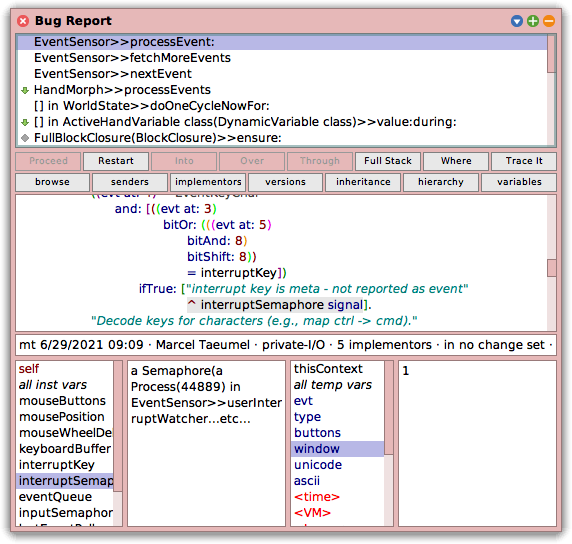

# DebugLogInspector

Parse Squeak DebugLogs and inspect them in a debugger.

Very young protoype. Not matured, thought-through, or tested thoroughly. Very likely not covers all edge cases of DebugLogs.

## What is it?

Whenever Squeak opens a debugger, a file named `SqueakDebug.log` is created. You can also manually create a DebugLog by right-clicking the context stack pane and selecting "copy bug report to clipboard". The result is a text file which contains many important information to reproduce a bug, but still is hard to grasp for programmers that are used to the graphical representation of the Squeak Debugger.

<small>
Example DebugLog:

```
21 September 2022 11:10:41.197736 pm

VM: Win32 - Smalltalk
Image: Squeak6.1alpha [latest update: #22218]

SecurityManager state:
Restricted: false
FileAccess: true
SocketAccess: true
Working Dir C:\Users\Christoph\Documents\squeak\TraceDebugger
Trusted Dir C:\Users\Christoph\Documents\squeak\TraceDebugger\Christoph
Untrusted Dir C:\Users\Christoph\OneDrive\Dokumente\My Squeak

EventSensor>>processEvent:
	pc: 440
	Receiver: an EventSensor
	Arguments and temporary variables: 
		evt: 	#(2 138885171 46 0 8 46 0 1)
		type: 	2
		buttons: 	nil
		window: 	1
		unicode: 	nil
		ascii: 	nil
	Receiver's instance variables: 
		mouseButtons: 	0
		mousePosition: 	1044@294
		mouseWheelDelta: 	0@0
		keyboardBuffer: 	a SharedQueue(0)
		interruptKey: 	2094
		interruptSemaphore: 	a Semaphore(a Process(44889) in EventSensor>>userInterruptWatcher...etc...
		eventQueue: 	a SharedQueue(1)
		inputSemaphore: 	a Semaphore()
		lastEventPoll: 	3841247441194
		hasInputSemaphore: 	true
		lastEventTime: 	138889875

EventSensor>>fetchMoreEvents
	pc: 146
	Receiver: an EventSensor
	Arguments and temporary variables: 
		eventBuffer: 	#(2 138885171 46 0 8 46 0 1)
		type: 	2
	Receiver's instance variables: 
		mouseButtons: 	0
		mousePosition: 	1044@294
		mouseWheelDelta: 	0@0
		keyboardBuffer: 	a SharedQueue(0)
		interruptKey: 	2094
		interruptSemaphore: 	a Semaphore(a Process(44889) in EventSensor>>userInterruptWatcher...etc...
		eventQueue: 	a SharedQueue(1)
		inputSemaphore: 	a Semaphore()
		lastEventPoll: 	3841247441194
		hasInputSemaphore: 	true
		lastEventTime: 	138889875

...etc...
```
</small>

(... truncated for clarity, you get the ieda. You can find some complete examples [here](./packages/DebugLogInspector.package/DebugLogInspectorTest.class/instance/fixtureHalt.st).)

The idea of this small tool is to parse a DebugLog and display it in a normal debugger:



You can:

- Interact with the context stack pane
- Inspect all objects and stack variables that were contained in the debug log
- Use the <kbd>Where</kbd> button to reveal the latest message send (requires a version of `Context>>#printDetails:` that includes the pc)
- Browse senders/implementors, variable references/assignments, class definition/inheritance/hierarchy like in a normal debugger

You cannot:

- Continue the program through the stepping buttons
- Inspect the details of displayed variables (they are just flat placeholders)

## Installation

```smalltalk
Metacello new
	baseline: 'DebugLogInspector';
	repository: 'github://LinqLover/DebugLogInspector';
	get;
	load.
```
